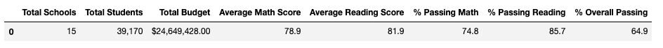
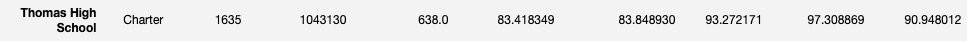
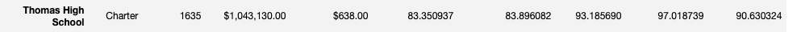
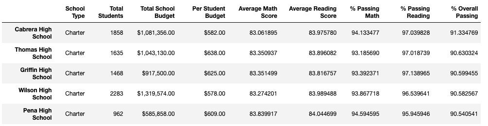
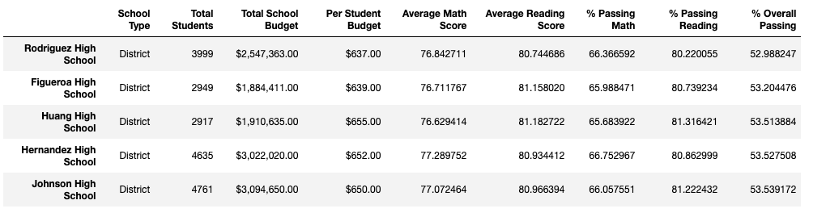
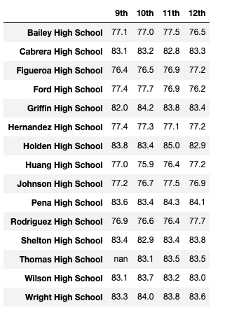
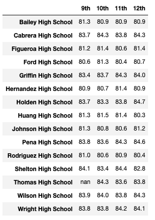
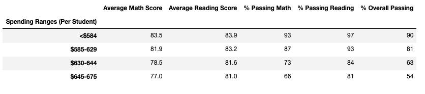
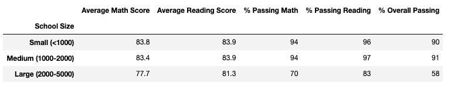
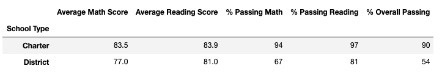

# School District Analysis

## Project Overview 

A school board has granted access to information relating to schools in a certain district and the standarzied test scores (math and reading) for each school. The board would like to have an analysis performed on the student and school data provided to see how well these schools are performing and how funding is allocated. 

After an intial analysis was performed, the school board detailed that scores from 9th graders at Thomas High School had been deemed inadmissibale and must be removed from the calculations. 

Detailed below is the method taken to analyze the two data sets (students and school sets), how they related to one another, and the results after THS scores had been removed. 

## Tools 

* Jupyter Notebook
* Pandas Library
* Numpy Library

## Methods

The data that was used for this analysis can be found in [Student Data](Resources/students_complete.csv) and [School Data](Resources/schools_complete.csv). The finalized code can be found in [PyCity Schools Code](PyCitySchools_Rework_Project.ipynb).

Within [Student Data](Resources/students_complete.csv) , pre-fixes were input onto certain values that needed to be removed with the following code:

  
    prefixes_suffixes = ["Dr. ", "Mr. ","Ms. ", "Mrs. ", "Miss ", " MD", " DDS", " DVM", " PhD"]

    for word in prefixes_suffixes:
      student_data_df["student_name"] = student_data_df["student_name"].str.replace(word,"")
    

The primary step in this analysis involved replacing the inadmissble grades for 9th graders at Thomas High School with "NaN" values. The following code was used to replace both math and reading scores:

    

    student_data_df.loc[(student_data_df["school_name"]=="Thomas High School") & (student_data_df["grade"]=="9th"), "reading_score"]=np.nan

    student_data_df.loc[(student_data_df["school_name"]=="Thomas High School") & (student_data_df["grade"]=="9th"), "math_score"]=np.nan

   
Secondly, an analysis was performed on the entire district. The results are as followed:

From there, the school analysis was performed. The following were organized into a new dataframe indexed on school name:

1. School Type (District vs. Charter)
2. Total Students
3. Total School Budget
4. per Student Budget
5. Average Math Score
6. Average Reading Score
7. Percentage of Students Passing Math 
8. Percentage of Students Passing Reading
9. Overall Percentage of Students (those who passed both math adn reading)

For Thomas High School, all of the 9th grade scores for math and reading were removed. The percentage of students passing math, reading, both subjects, and overall passing percentage needed to be recalculated with those scores removed. The summary points were not caluclated with THS 9th graders as "0" values. These summary points were calculated for only 10-12th graders which were used for the per_school_summary_df(above). The following is a before and after picture:

* Before

* After

Finally, the below dataframes were created to complete the analysis with the new data:

1. High Performing Schools
2. Low Performing Schools
3. Schools Grouped by Math and Reading Scores
4. Scores Grouped by School Budget per Student
5. Scores Grouped by School Size
6. Scores Grouped by School Type

## Results 

* High Performing Schools

* Low Performing Schools

* Schools Grouped by Math Scores

* Schools grouped by Reading Scores

 

* Scores Grouped by School Spending per Student

* Scores Grouped by School Size 

* Scores Grouped by School Type

